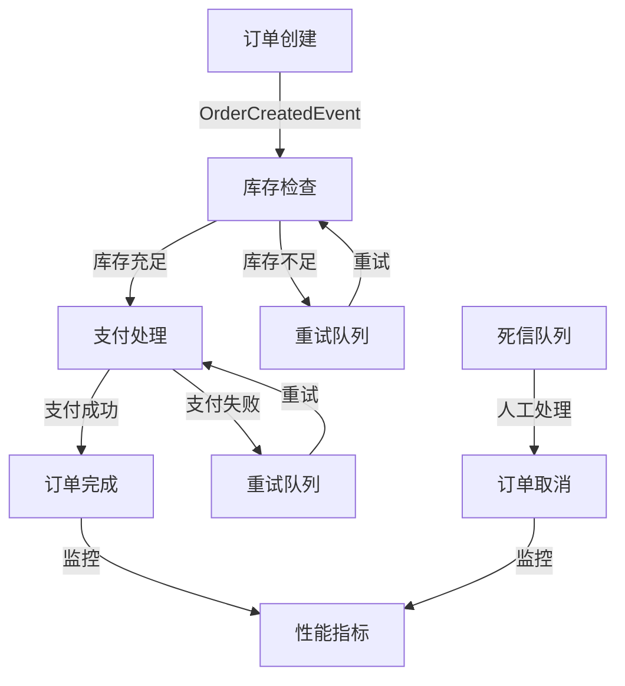

# Order Processing System

基于 Spring Boot 和 Kafka Streams 的订单处理系统，支持订单创建、库存检查、支付处理等功能。

## 功能特性

- 订单创建和处理
- 库存检查
- 支付处理
- 重试机制
- 死信队列处理
- 性能监控
- 性能测试

## 技术栈

- Spring Boot 3.2.3
- Spring Kafka
- Spring Cloud Stream
- Kafka Streams
- Micrometer
- Prometheus
- Grafana
- JMeter

## 项目结构

```text
src/
├── main/
│   ├── java/
│   │   └── com/
│   │       └── example/
│   │           ├── config/
│   │           ├── domain/
│   │           ├── events/
│   │           ├── exception/
│   │           ├── service/
│   │           └── OrderProcessingApplication.java
│   └── resources/
│       └── application.yml
└── test/
    ├── java/
    │   └── com/
    │       └── example/
    │           ├── config/
    │           └── performance/
    └── jmeter/
        └── OrderProcessingTest.jmx
```

## 工作流程



## 配置说明

### Kafka Streams 配置

- 应用 ID: order-processing-streams
- 提交间隔: 1000ms
- 处理保证: exactly_once_v2
- 流线程数: 2
- 备用副本数: 1
- 复制因子: 3
- 最小同步副本数: 2

### 监控配置

- 端点: health, info, metrics, prometheus
- 指标标签: application
- 延迟分布: 10ms, 50ms, 100ms, 200ms, 500ms

## 运行说明

1. 启动 Kafka 和 Zookeeper
2. 启动 Prometheus 和 Grafana
3. 运行应用
4. 运行性能测试

### 启动应用

```bash
./gradlew bootRun
```

### 运行单元测试

```bash
./gradlew test
```

### 运行性能测试

```bash
./gradlew performanceTest
```

## 监控指标

### 订单指标

- orders.created: 创建的订单数
- orders.completed: 完成的订单数
- orders.cancelled: 取消的订单数

### 库存指标

- inventory.checks: 库存检查次数

### 支付指标

- payments.processed: 处理的支付数
- payments.failed: 失败的支付数

### 重试指标

- retries: 重试次数（按操作类型）

### DLQ 指标

- dlq.messages: DLQ 消息数（按主题）

## 性能测试场景

1. 订单创建性能测试
   - 批量创建订单
   - 测量处理时间

2. 并发订单处理测试
   - 多线程并发处理
   - 验证系统稳定性

3. 负载测试
   - 持续发送订单
   - 监控系统性能

## 注意事项

1. 确保 Kafka 集群正常运行
2. 监控系统资源使用情况
3. 定期检查日志
4. 关注性能指标 